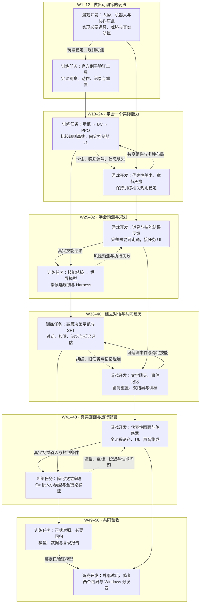
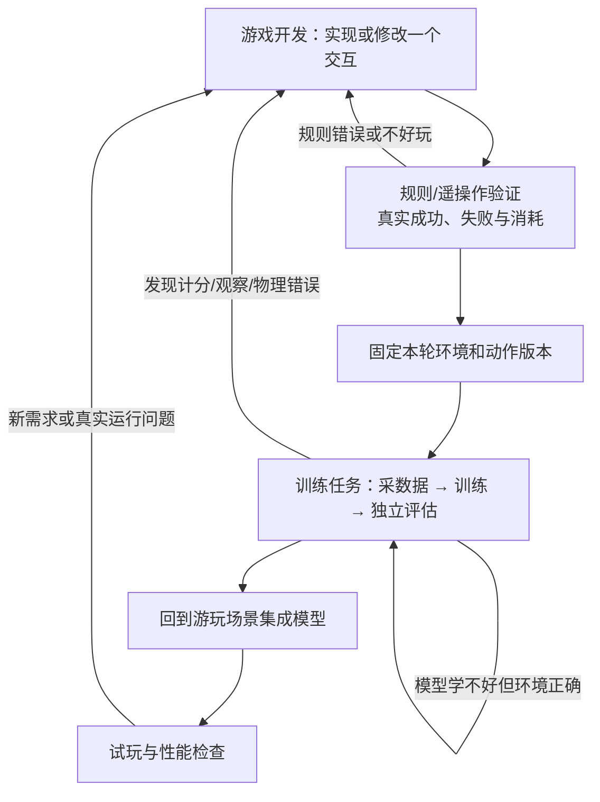

# 《雾境拾荒》项目排期：游戏开发与训练交替推进

版本：v2.1｜更新：2026-09-10｜状态：执行规划，尚未完成开发验收。

本文件替代《双人开发任务表.md》的人员分工、任务周次和实施顺序。你和朋友共同参与所有步骤，不再指定 A/B 负责人。游戏开发与训练是两类工作，不是两个人或两支独立团队。

## 1. 首版目标与时间口径

首版交付仍为 20–30 分钟完整短篇：第三人称斜俯视 3D、人类玩家与核心机器人搭档、搜集与撤离、生存恐怖、有限战斗、完整线性故事及“重置失忆/永久停机”两个结局。先做三个紧凑场景、一个核心协作机制、一个核心敌人行为类型、一种主要防卫手段和少量必要道具；具体内容须通过原型锁定。

算法成果保留三个功能模型：低层 BC/PPO 策略、技能条件世界模型、高层 SFT Agent；保留一个简化视觉控制实验和一个小模型的 Unity C# 部署验证。增加已讨论的随时文字对话：闲聊、现场、共同经历与委托，简短回复、危险优先。C++ 原生插件、VLA、XR、高层 RL、语音为后续可选专题，不挤进本次首版。

**新版首版基线为 56 周，W1 从实际开工计起，不按文档日期倒推。** 旧 48 周基线没有正式分配随时文字聊天的增量工作；本次增加 8 周，把聊天集成和联合验证明确排入，并重新安排依赖。这是估算，不保证训练收益或固定日期交付。

暂沿用此前合计每周约 20 人小时的投入，不再将两个人的时间绑定特定工种。一起做 2 小时，按 4 人小时记录；不能把两人结对的 10 小时计算成 20 小时独立产出。

| 投入 | 每周合计 | 56 周合计 |
|---|---:|---:|
| 游戏开发与训练任务，含学习 | 15 人小时 | 840 人小时 |
| 共同复盘与计划更新 | 2 人小时 | 112 人小时 |
| 返工与阻塞缓冲 | 3 人小时 | 168 人小时 |
| 总计 | 20 人小时 | 1120 人小时 |

每四周一个阶段，有 60 人小时计划任务。两类任务工时之和始终等于 60，不假设能满负荷并行。每阶段根据实际完成量重估；若两人始终共同操作同一台电脑，或有效投入低于假设，应依据实际速度延长，不承诺“人多就加速”。

现金总上限仍为 9800 元，首版额度 4200 元、后续 5600 元；延长排期不自动增加现金预算。游戏与模型尚未开始制作，下面所有阶段初始状态均为“未开始”。

## 2. 总图：两类工作如何交接

下图按周次从上到下阅读；左右是工作类别。实线表示主要依赖，虚线表示测试结果反馈。方块美术可以先用，道具效果、碰撞和成功失败规则必须真实运行。

同一阶段的左右任务也有先后，例如 P07 必须先检查冻结版本的技能结果，再采数据和训练世界模型。无依赖的游戏工作可以利用 GPU 训练等待时间推进；若争用同一张 5080，应错峰，不把等待期间的理论空闲重复计入工时。

## 3. 详细排期：十四个共同完成的阶段

“开始条件”是门槛，不因日历走到该周就视为通过。G/T 工时只表达该阶段的工作重心，不分配给特定成员。学习、实验设置、人工数据检查包含在任务工时内；纯 GPU 运行时间另记。

| 阶段 / 周次 | 游戏开发任务 G | 训练任务 T | 开始条件与阶段验收 | G / T 人小时 |
|---|---|---|---|---:|
| P01 / W1–4 | 地面、人物、俯视相机、碰撞；规则机器人跟随/等待/到点；独立构建 | 核查 5080 与依赖；官方例子短训练、导出加载；最小观察/动作/事件记录与 reset | 从设备核查开始；人物与机器人独立控制，官方训练链可运行，10 次重置无残留。官方模型不作为游戏策略 | 45 / 15 |
| P02 / W5–8 | 两个短协作灰盒；只实现候选必需道具、一个威胁和交互；故事梗概与两个结局因果线 | 用规则/遥操作执行候选；检查可观察信息、动作边界、失败定义和数据能否记录 | P01；候选各可在数分钟内重试，试玩能指出机器人提供的具体帮助；此时不做正式游戏策略训练 | 48 / 12 |
| P03 / W9–12 | 选一个核心协作机制；做约 5 分钟规则闭环；必要道具具备可用/消耗/失败逻辑；完成一个简化美术样板 | 固定首个学习任务、观察/动作/奖励；配置训练区域和布局变体；检查重置、计分、遮挡及传感器坐标 | P02；达到第 4 节训练门槛，约 20 个配置的规则检查通过；冻结环境 E1，核心机制尚不好玩则继续原型 | 42 / 18 |
| P04 / W13–16 | 修正试玩与采样暴露的交互问题；扩展同机制布局；开始章节检查点 | 规则教师或机器人遥操作采示范；清洗、隔离训练测试；训练 BC，形成规则/BC 对照 | P03；同一动作协议，数据来源与版本清楚，有任务成功率、失败样例；不要求 BC 必须超过规则 | 24 / 36 |
| P05 / W17–20 | 将美术样板应用到一个区域；整理威胁反馈和声音；不静默改变 E1 的碰撞及道具规则 | PPO 从简单布局开始，再加入已实现的威胁/玩家干扰；检查奖励分项、学习曲线与采样效率 | P04；可保存恢复训练，无已知刷分漏洞；未见配置评估不参与调参 | 18 / 42 |
| P06 / W21–24 | 三个场景的完整占位故事，补齐当前机制所需交互、检查点与双结局占位分支 | 规则/BC/PPO 对照；固定控制器 C1 与环境版本；验证技能转移记录，准备世界模型试集 | P05；20–30 分钟占位故事可走通，学习结果可追溯，C1 可重复执行。W24 为中期演示，不要求世界模型已完成 | 36 / 24 |
| P07 / W25–28 | 为既有技能完善开始/完成/失败/中断反馈；处理采样发现的真实状态错误 | 用固定 E1/C1 采约 2000–5000 条技能转移；小型 GRU 对比简单预测，评估状态、耗时和风险校准 | P06；数据带版本，失败有覆盖；有独立测试结果。修改了环境或控制器则明确新版本并更新受影响数据 | 18 / 42 |
| P08 / W29–32 | 接玩家委托和机器人任务 UI；展示受阻/取消/完成；断开服务仍能操作 | 接 K=3、H=1 候选规划、世界模型消融、LangGraph Harness；测试取消、去重、过期响应与超时 | P07；模型推理不暂停世界，过期任务不执行；保持实际执行结果为权威。开始收集并人工审查高层决策样例 | 24 / 36 |
| P09 / W33–36 | 最小文字聊天：闲聊/现场/经历/委托；稳定角色设定与事件记忆；剧情失忆和存档访问一致 | 先用未微调候选模型验证完整聊天链；评估事实来源、委托落地、记忆清除和危险优先；初测本地/云端候选 | P08；四类对话均可试，回复简短；委托有真实结果，剧情重置后不能检索旧经历。端侧/云端决定依据实测，不在此训练私人记忆 | 30 / 30 |
| P10 / W37–40 | 完善共同经历、对白过渡与双结局演出；修复聊天/任务 UI；补全重置前后读档回归 | 审核约 1000–3000 个高层技能决策样本，做小规模 LoRA/SFT；与原模型比较合法调用、任务成功和时延 | P09；技能和事实接口稳定，数据不含当前玩家私人记忆。SFT 训练目标仍是技能决策；聊天质量单独评估，不假设随 SFT 自动改善 | 30 / 30 |
| P11 / W41–44 | 提供接近正式风格的一个视觉控制区域；核实 RGB-D、遮挡、机器人视角；全流程美术整合 | 在一个简化任务采视觉示范并训练视觉策略；选择兼容推理库，用 C# 加载导出的一个小模型，核对固定输入输出 | P06 控制规范、P10 系统可用；图像与状态时间对齐、无隐藏真值泄漏；模型可在 Unity 内运行。视觉分支只覆盖一个任务，不接管全部游戏 | 24 / 36 |
| P12 / W45–48 | 三场景资产/灯光/声音/UI 集成，保持可读性与帧时间；打通两个结局 | 完成视觉泛化检查、C# 小模型控制闭环；整合高层、世界模型、低层；核查数值、动作、延迟、资源和加载失败处理 | P11；完整短篇使用真实模型链；规则回退有标记；PyTorch/部署数值与动作一致，独立 Windows 构建可运行。W48 达到全系统 Alpha | 24 / 36 |
| P13 / W49–52 | 5–10 位外部试玩，记录任务理解、搭档价值、恐怖节奏、失忆代价；修关键软锁 | 固定候选版本完成正式算法/系统评估；测试集隔离、种子与采样预算报告；整理失败与性能瓶颈 | P12；两结局都覆盖，形成问题清单；测试集不得用于继续筛最佳模型，修改后明确重新评估范围 | 36 / 24 |
| P14 / W53–56 | 修复阻断问题；最终 Windows 包、操作说明、素材许可清单、未剪辑演示 | 必要回归、冻结发布模型与版本；整理数据样例、训练/评估入口、对照和复现报告 | P13；另一人在干净环境能启动并复现一个实验；缺关键项就顺延，不只因到 W56 标完成 | 36 / 24 |

上表任务合计：游戏开发 435 人小时、训练任务 405 人小时，共 840；加复盘 112、缓冲 168，共 1120 人小时。两类任务均由两人共同参与。

P09–P10 中共同经历、对话、SFT、剧情本身还有既有工作，不能把整个八周都当成新增聊天的独立预算。聊天新增开发与检查从跨阶段任务中分配，P08 的委托接口与 P13 的外测也支撑它；通过阶段实耗判断是否需要顺延。

### P11–P12 的部署范围

必做路线：Python/PyTorch 训练 → 导出模型 → Unity C# 调用现成推理库 → 获取动作 → 游戏执行。优先验证 Unity Inference Engine；若模型算子或平台需求不适配，再评估 ONNX Runtime C#。实际只选择一条通过兼容验证的路线，不要求同时集成两套推理库，也不自行编写 C++ 动态库。

目标是一个已经训练好的小型控制模型，不是聊天大模型；可先部署稳定的结构化策略，不强制等待视觉策略训练完成。核对至少 100 条固定输入的输出误差、输入顺序/归一化、动作缩放与实际闭环；记录冷启动、P50/P95 推理时延、内存/显存及游戏帧时间；测试模型加载失败、推理超时与独立 Windows 构建。结果绑定模型和运行库版本。

上述一致性、性能和稳定性检查不因采用 C# 而取消。P11–P12 的阶段工时和 56 周基线暂不变，原先预估给 C++/CMake 学习与跨语言封装的容量转用于兼容检查、实机部署与问题修复；按实际耗时重估，不虚构固定节省量。

参考：[Unity Inference Engine](https://docs.unity3d.com/Packages/com.unity.ai.inference@2.2/manual/index.html)、[ONNX Runtime C#](https://onnxruntime.ai/docs/get-started/with-csharp.html)。这是候选路线，尚未锁定版本或实测通过。

## 4. 正式训练前，游戏必须做到哪一步

P01 官方例子只是安装与训练链路检查；P04 开始的是我们游戏中选定任务的训练。进入 P04 前至少要满足以下六项：

1. **任务可玩：** 能通过规则或遥操作完成，成功与失败可解释；机器人确实参与，而非只有玩家独自完成。
2. **道具真实：** 本任务需要的道具能够发现、交互、消耗或改变状态；取消、目标失效和使用失败返回实际结果。外观可以是方块。
3. **物理稳定：** 相关碰撞、角色尺寸、门宽、遮挡、移动和交互距离已经实现。暂时不需要完整地图。
4. **观察动作明确：** 模型读什么、输出什么、何时决策、哪些信息未知写清楚；不因调试方便提供全图敌人真值。
5. **数据能用：** 观察—动作—奖励/结果可对应到同一回合与时间；记录环境版本；训练、验证、测试按布局/会话分开。
6. **可重复运行：** 至少 10 次重置无残留；计分不重复，死亡与时间截断分开；人工检查奖励分项。

缺道具规则就先做规则，缺可用玩法就先做原型。不得用编造的“成功结果”替代游戏执行，也不需要为了开始训练先制作六小时内容。

## 5. 每一轮如何穿插：同一套玩法，两种场景用途

最先只建一个灰盒。出现正式采样需求后，再区分“小型训练场景”和“剧情游玩场景”：前者快速重置、改变布局并批量运行；后者有章节、UI、声音与演出。两者复用相同的角色、道具与交互逻辑；不写两套互相漂移的规则，也不预先建设通用场景生成平台。

“模型学不好”先检查数据、奖励、训练设置与任务难度，不自动修改游戏为模型让路；确实改变了玩法规则，就进入新版本并重新判断数据是否仍有效。

推荐每个四周阶段都按“共同确定本轮小目标 → 做出最小可用功能 → 验证或训练 → 实机集成与记录”推进。训练任务运行期间可以一起做对白、素材整理等轻量工作；耗显存的编辑器渲染、录制与训练分时安排。

## 6. 道具逐步增加时，三个模型分别怎么处理

以下以“使用电池补能”为说明例子，不将其确认为本项目必做道具。

| 步骤 | 游戏开发 | 训练任务 |
|---|---|---|
| 功能原型 | 方块代表电池；实现可观察、拾取、使用、消耗和电量变化 | 先用规则调用测试，尚不能声称模型已学会新道具 |
| 初次数据 | 对每次执行记录起止状态、时间、结果与版本 | 采成功、不可达、目标被玩家拿走、中断等实际存在情况 |
| 高层决策 | 将合法技能及条件暴露给 Agent | 补“何时使用”的技能示范，评估原模型再决定微调；未知技能在未接好前不可执行 |
| 世界模型 | 固定实际消耗、执行器与结果定义 | 补新技能转移，检验预测；固定电量增量先与直接计算基线比较，重点研究不确定耗时/风险 |
| 低层控制 | 实现前往、停靠、交互执行 | 只有新的移动/操作要求影响策略时才补 BC/PPO；库存扣减是程序逻辑，不单独训练 |
| 美术替换 | 方块换成正式模型，检查尺度、碰撞和可见性 | 结构化版本先回归；视觉版本补代表性画面并评估，不承诺无需适配 |

一个技能稳定后再训练这个技能。新道具上线不自动推翻所有旧模型，也不自动得到旧模型的泛化能力；按实际变化确定需要补哪些数据和评估。

## 7. 游戏改动如何影响已有数据和模型

| 变化 | 主要影响 | 必须做的下一步 |
|---|---|---|
| 仅换贴图/材质，物理与结构化观察不变 | 结构化策略通常影响较小；RGB 输入变化 | 先运行回归；视觉模型在新画面上单独评估，必要时补数据 |
| 改光照、雾、相机角度或遮挡 | 视觉/深度可用信息、可见范围变化 | 核查传感器与玩家画面分别受何影响；补对应感知条件测试 |
| 改门宽、碰撞体、速度或交互距离 | 低层控制分布、技能耗时/成功率变化 | 新环境版本；策略复测，世界模型补受影响技能数据 |
| 改道具效果或使用条件 | 世界模型转移标签、高层选择依据变化 | 更新规则与技能说明，重采相关转移，审查过时的 SFT 样本 |
| 新布局但沿用已有机制 | 可能超出已训练布局分布 | 先作为新场景评估；要用于补训练时另保留独立测试布局 |
| 换低层控制器或导航实现 | 相同技能的耗时、轨迹和风险变化 | 记录控制器新版本；不能把旧控制器轨迹当新控制器真值，补采并重评世界模型 |
| 改观察/动作字段、顺序或含义 | 输入输出与旧模型不兼容 | 先判断是否必须改协议；明确版本并更新数据、训练和部署，不静默沿用旧权重 |
| 修改剧情事实、失忆或记忆访问 | 高层对话、记忆与分支一致性 | 更新事实/权限与回归；不必因改对白重训运动策略 |

本轮训练使用固定的环境与控制器快照，游戏工作可在另一个开发版本继续。现在用 Git 提交、配置和数据中的版本号即可；不增加大型模型管理平台。

补训练不等于必然从零训练。兼容检查点可以实验性继续训练，但要复测旧能力；训练集加入新章节后，测试集仍须独立。模型达不到要求时保留规则方案的可玩版本，并如实区分算法实验与产品回退。

## 8. 关键里程碑与停下来修什么

| 周次 | 必须拿得出的东西 | 未通过时的处理 |
|---|---|---|
| W4 | 人物与规则机器人可操作，官方训练、构建、数据重置通过 | 修工具链和基本环境，不进入正式模型训练 |
| W12 | 一个好理解的 5 分钟协作原型，必要道具真实可用，训练任务定义固定 | 在原型内再迭代；不铺全地图、不靠增加模型补玩法 |
| W20 | BC/PPO 实验记录、固定测试条件、明确失败原因 | 排查环境和奖励，再调整训练；不声称一定优于规则 |
| W24 | 占位完整故事与策略对照，固定 C1 | 未通过就延后世界模型正式采集；故事和道具改变要记录影响 |
| W32 | 世界模型离线评估及规划消融、可靠任务执行 | 无预测收益时交付负结果与简单基线；服务错误优先修复 |
| W40 | 文字对话、共同经历、失忆分支、SFT 对照 | 禁止靠生成对白掩盖逻辑缺口；修记忆与委托执行 |
| W48 | 全系统 Alpha、视觉专题、C# 小模型部署闭环与独立构建 | 停新增功能；缺项明确顺延，不占用外测做大规模开发 |
| W56 | 完整短篇、两结局、外测记录、算法与部署报告、可复现包 | 有阻断问题则不标完成，依据剩余工时排下一轮 |

正式评估沿用同任务的规则/BC/PPO、原模型/SFT、有无世界模型对照；结构化与视觉信息条件分别报告。正式结构化测试目标至少 100 个独立任务配置、训练目标 3 个种子，预算不足标明实际数，不拼凑统计可信度。视觉专题只验证一个简化任务。

## 9. 第一个月：现在一起做什么

以下是 P01 的细化，不是额外工时。若安装或学习超出阶段容量，后续周次顺延。

| 周次 | 游戏开发 | 训练任务 | 当周可见成果 |
|---|---|---|---|
| W1 | 学习编辑器、场景、组件；地面与胶囊角色、相机 | 核实 5080/驱动/软件，选依赖并做真实 GPU 运算 | Play 后能看见场景和角色；真实硬件记录 |
| W2 | 人物移动、碰撞、简单墙体；构建 Windows 程序 | 官方最小例子短训练、导出并加载 | 角色能动，官方模型能运行；不需要游戏道具数据 |
| W3 | 小机器人独立控制；规则跟随与等待 | 定义最小观察/动作/事件及时间坐标约定；记录真实执行 | 玩家和机器人分别行动，记录能对应到实际事件 |
| W4 | 到点/召回、受阻反馈、修复挡路问题 | Python 记录和回合重置；连续 10 次检查；版本与复现说明 | 一个可重复的小闭环，进入协作机制原型 |

P01 不做正式世界模型/SFT/PPO 游戏任务，不购买大批美术，不制作完整地图。这里的官方训练是工具检查，后面 P04/P05 的训练才针对选定游戏能力。

## 10. 首版之后怎样扩展到约六小时

约六小时的最终目标保留。P14 通过后，先做六章大纲和一个 50–70 分钟完整样章，用实际每十分钟内容的工时、费用和缺陷数量估算剩余章节。

每个新增章节都重复同一个顺序：章节灰盒与必要交互 → 规则可玩 → 新任务/道具影响判断 → 按需补数据与训练 → 美术演出 → 全流程回归。已有机制换场景先做泛化评估；新动作、新规则则先实现环境。不会每章从头训练三个模型，也不会在全游戏完成后才第一次验证模型。

旧任务表的后续 100 周只是历史产能假设，不机械接成新的固定 156 周承诺。扩产工期应在样章后重排；仍受 9800 元累计现金上限约束。VLA/XR 等专题执行时另占团队工时，并顺延对应内容工作。

C++ 原生插件仅为后续可选学习实验：在 C# 部署已经稳定后，如需接入特定原生库或专门练习 C++/CMake，再对同一小模型做原生插件对照，比较数值、调用开销与维护成本。不作为首版验收条件，也不预设增加 C++ 层会提高性能；执行前另排工时与预算。

## 11. 文档与迁移说明

本文件是最新执行入口；旧双人任务表保留作历史预算和任务细节追溯，其 A/B 分工、48 周周次和里程碑不再执行。主规划第 22 节剧情事实继续有效。

2026-09-09 的迁移 ZIP 是旧快照，不包含本次排期和同步修订。若继续迁移，请以当前工作目录的新文件为准；不要把旧包覆盖回当前版本。本次只更新排期和相关文档，未启动游戏开发或模型训练。
